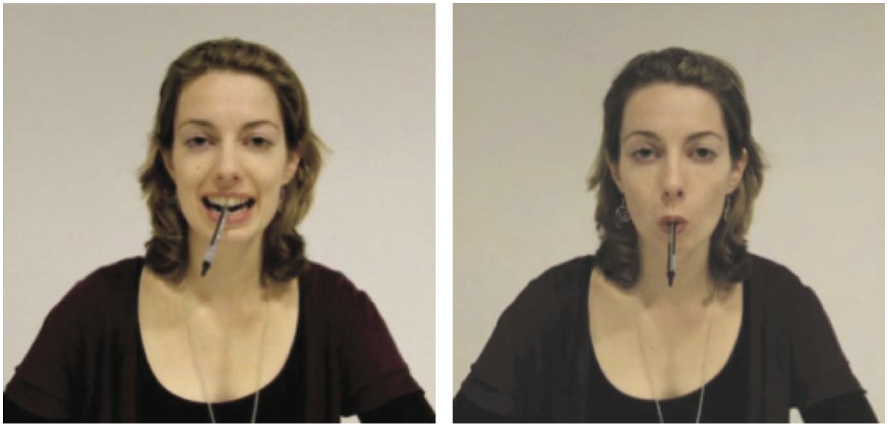

```{r setup, include=FALSE}
knitr::opts_chunk$set(echo = FALSE, comment = "#>", dpi = 400)

library(mustashe)
library(nakedpipe)
library(magrittr)
library(glue)
library(patchwork)
library(bayestestR)
library(see)
library(tidybayes)
library(bayesplot)
library(rstanarm)
library(tidyverse)

theme_set(
  theme_minimal() +
    theme(
      strip.text = element_text(face = "bold"),
      plot.title = element_text(hjust = 0.5)
    )
)
```

## Introduction

### Background

In his famous book, [*Thinking, Fast and Slow*](https://en.wikipedia.org/wiki/Thinking,_Fast_and_Slow), [Daniel Kahneman](https://en.wikipedia.org/wiki/Daniel_Kahneman) describes how our mind acts in many ways that we are completely unaware of [@kahneman_2011].
One such phenomenon is "priming" where one event (e.g. hearing a word spoken, seeing an image) brings associated ideas into our mind and available for faster recall than other terms.
One form of priming is that a physical movement we make can affect how our mind behave.

One example that Kahneman provides was illustrated by Strack *et al.* in 1988 where they asked participants to rate their perceived level of amusement of several [The Far Side](https://en.wikipedia.org/wiki/The_Far_Side) cartoons [@Strack1988-zd].
The caveat was that the participants viewed the comics while holding a pencil with their teeth, either sideways with the eraser pointing to their right or pointing forwards with the eraser between their teeth.
The first pose induces a facial expression similar to smiling whereas the latter causes a frowning motion, but the participants are unaware of this effect.
This acts as a primer to make the participants easier or harder to amuse, respectively, and this was measured by a reduced rating of the cartoons by the frowning group.

This was just one example provided by Kahneman, but I was curious about the actual effect size of these phenomenon.
Is this causing swings from elation to depression, or from mild pleasure to mild displeasure?
How influential were these priming effects?
So I decided to look up this paper, "Inhibiting and Facilitating Conditions of the Human Smile: A Nonobtrusive Test of the Facial Feedback Hypothesis" ([PDF](papers/Strack_1988_Inhibiting-and-facilitating-conditions-of-the-human-smile-a-nonobtrusive-test-of-the-facial-feedback-hypothesis.pdf)), and do some analysis for myself.
Unfortunately, the original data is not provided with the paper, but I did find a replication of the experiment, "Registered Replication Report: Strack, Martin, & Stepper (1988)" ([PDF](papers/Wagenmakers-et-al_2016_APS.pdf)) [@Wagenmakers2016-bj].
I was able to acquire this data set and conduct a statistical analysis for myself.

### Experimental procedure

Below is the experimental producer of the replication report [@Wagenmakers2016-bj].

>Participants worked through the tasks in the task booklet while holding the pen in their mouth.
> The first task was to draw lines between a series of successive numbers and the second task was to underline vowels.
> The third and crucial task was to rate how amused they were by four cartoons.
> For each cartoon, participants answered the question “What feeling was elicited in you by looking at the cartoon?” by using a 10-point Likert scale ranging from 0 (I felt not at all amused) to 9 (I felt very much amused).
>
>After these tasks, participants removed the pen from their mouths and completed an exit questionnaire that asked three questions: (a) “How successful were you in holding the pen in the correct position during the entire experimental session?” (the answer was indicated on a 10-point Likert scale, as in SMS Study 2); (b) “Did you understand the cartoons?” (yes/no); and (c) “What do you think the purpose of this experiment is?” (open-ended).

Below is an image demonstrating the positions.

```{r pencil-demo, fig.cap="Demonstration of holding the pencil to force a smile (left) or frown (right) [@Wagenmakers2016-bj]."}

```

There were a few criteria by which a data point or participant could be excluded from the data set.
There are reproduced below and the excluded data points were indicated in the published data set.

> Exclusion criteria were deliberately strict.
> Data were excluded from participants whose average cartoon rating exceeded 2.5 standard deviations from the group mean in their condition.
> Data were excluded if, based on the exit questionnaire, participants correctly guessed the goal of the study (i.e., the position of the pen influences the funniness ratings for the cartoons).
> Data were also excluded if a participant answered “No” to the question “Did you understand the cartoons?”.
> Finally, data were excluded from participants who held the pen incorrectly for two or more of the cartoons (based on the video recordings).
> If participants held the pen incorrectly for just one cartoon, data from that cartoon rating were excluded from analyses.

## Data preparation

Below is the code for preparing the data.
Two subjects, 63 and 39, were removed because they had a lot of missing data points.
Otherwise, the data was left as is and only rearranged for ease of use in data visualization and modeling.

```{r, echo=TRUE}
subjects_to_remove <- c("63", "39")

# CLean the initial data columns.
data <- read_csv("data/Wagenmakers-data_modified.csv") %.% {
  janitor::clean_names()
  mutate(
    subject_number = factor(subject_number),
    participant_id = factor(participant_id),
    across(starts_with("cartoon") & ends_with("correct"), as.logical),
    aware_of_goal = as.logical(aware_of_goal),
    comprehension_of_cartoons = as.logical(comprehension_of_cartoons),
    student = as.logical(student),
    gender = case_when(
      gender == 1 ~ "M",
      gender == 0 ~ "F",
      TRUE ~ NA_character_
    )
  )
  filter(!subject_number %in% subjects_to_remove)
}

# Pivot the data into a long format.
data <- data %.% {
  select(-contains("task"), -guess_of_purpose)
  pivot_longer(cols = c(contains("cartoon"), -comprehension_of_cartoons))
  mutate(name = str_remove(name, "^cartoon_"))
  separate(name, into = c("cartoon_number", "variable"), sep = "_")
  pivot_wider(names_from = variable, values_from = value)
  mutate(
    correct = as.logical(correct),
    cartoon_number = glue::glue("Cartoon {cartoon_number}"),
    condition = ifelse(condition, "frown", "smile")
  )
}
```

We can see that there are a few subjects whose occupation is unknown and there is one missing cartoon rating data point (belonging to subject 31).

```{r}
naniar::miss_var_summary(data) %>%
  filter(n_miss > 0) %>%
  rename(
    `num. missing` = n_miss,
    `percent missing` = pct_miss
  ) %>%
  kableExtra::kbl() %>%
  kableExtra::kable_styling(
    bootstrap_options = c("striped", "hover", "responsive")
  )
```

Per the original experimental design and protocol, subjects were excluded if they:

- were aware of the research goal,
- did not understand the cartoons

```{r, echo=TRUE}
excluded_subjects <- data %.% {
  filter(aware_of_goal | !comprehension_of_cartoons | total_correct <= 2)
  pull(subject_number)
  unlist()
  unique()
}

data <- data %>%
  mutate(excluded_data = subject_number %in% excluded_subjects)
```

This resulted in `r length(excluded_subjects)` subjects that were excluded from the analysis.

## Data visualization

As always, it is important to visualize the data before statistical analysis.
The goal is to get a general understanding for the scale of effect sizes and patterns that will be tested later.

The plot below shows the distribution of ratings for each of the four cartoons, separated by the frown/smile experimental condition.
Visually, there does not appear to be much of a difference.

```{r}
data %>%
  filter(!is.na(rating)) %>%
  ggplot(aes(x = condition, y = rating, color = condition)) +
  facet_wrap(~cartoon_number) +
  geom_point(
    size = 1,
    alpha = 0.5,
    position = position_jitterdodge(
      jitter.width = 0.4,
      jitter.height = 0.25,
      seed = 0
    ),
    show.legend = FALSE
  ) +
  geom_boxplot(
    aes(fill = condition),
    alpha = 0.2,
    outlier.shape = NA
  ) +
  scale_color_brewer(type = "qual", palette = "Set1") +
  scale_fill_brewer(type = "qual", palette = "Set1") +
  labs(x = NULL, y = "rating")
```

We can further subdivide the participants by sex, but this does not reveal a strong pattern, either.

```{r}
data %>%
  filter(!is.na(rating)) %>%
  ggplot(aes(x = condition, y = rating)) +
  facet_wrap(~cartoon_number) +
  geom_point(
    aes(color = gender),
    size = 1,
    alpha = 0.5,
    position = position_jitterdodge(
      jitter.width = 0.2,
      jitter.height = 0.25,
      seed = 0
    ),
    show.legend = FALSE
  ) +
  geom_boxplot(
    aes(color = gender, fill = gender),
    alpha = 0.2,
    outlier.shape = NA
  ) +
  scale_color_brewer(type = "qual", palette = "Set2") +
  scale_fill_brewer(type = "qual", palette = "Set2") +
  labs(x = NULL, y = "rating")
```

The next plot presents the distribution of rating scores per cartoon for the two conditions side-by-side.
If we assume that these distributions can be approximated by Gaussian distributions, there does not seem to be a difference between the two groups.

```{r}
rating_counts <- data %.% {
  filter(!is.na(rating) & !excluded_data)
  count(condition, rating, cartoon_number)
  tidyr::complete(condition, rating, cartoon_number, fill = list(n = 0))
  group_by(condition, cartoon_number)
  mutate(frac = n / sum(n))
  ungroup()
}


rating_counts %>%
  ggplot(aes(x = factor(rating), y = n)) +
  facet_wrap(~cartoon_number, nrow = 2) +
  geom_col(aes(fill = condition), position = "dodge") +
  scale_fill_brewer(type = "qual", palette = "Set1") +
  scale_y_continuous(expand = expansion(c(0, 0.02))) +
  theme(legend.position = "bottom") +
  labs(
    x = "cartoon rating",
    y = "count",
    fill = "condition"
  )
```

Instead of showing the number of different ratings for each cartoon in each experimental condition, we can subtract one the counts of one from the other.
This is shown below, where the number of each rating in the frown condition is subtract from that of the smiling condition.
If a cartoon was rated higher in the smiling condition than in the frowning condition, we would expect to see a general increase in the plots from left to right.
Instead, there is no obvious trend and the line wanders around 0 indicating a lack of a trend.

```{r}
rating_counts %.%
  {
    select(-n)
    pivot_wider(names_from = condition, values_from = frac)
    mutate(difference = smile - frown)
  } %>%
  ggplot(aes(x = factor(rating), y = difference)) +
  facet_wrap(~cartoon_number) +
  geom_hline(yintercept = 0) +
  geom_line(
    group = 1,
    alpha = 0.2,
    size = 0.9,
    color = "black"
  ) +
  geom_point(aes(color = difference), size = 2.5) +
  scale_color_gradient2(
    low = "blue",
    high = "red",
    mid = "grey70",
    guide = FALSE
  ) +
  labs(
    x = "cartoon rating",
    y = "diff. fraction (smile - frown)"
  )
```

Another factor to consider is the age of the participant.
It is possible that some cartoons appealed to people of different ages due to different perceptions of cultural references, political affiliations, etc.
From the plot below, we can see that most patients were around 20 years old and there is no correlation between age of the participant and their average rating of the cartoons.

```{r, message=FALSE, warning=FALSE}
rating_summaries <- data %>%
  filter(!is.na(rating)) %>%
  group_by(
    participant_id,
    condition,
    gender,
    comprehension_of_cartoons,
    correct,
    excluded_data
  ) %>%
  summarize(
    avg_rating = mean(rating),
    avg_age = mean(age)
  ) %>%
  ungroup()
```

```{r}
age_vs_rating_historgram_factory <- function(d, x, flipped = FALSE) {
  x_vals <- d %>%
    pull({{ x }}) %>%
    unlist()
  min_x <- min(x_vals)
  max_x <- max(x_vals)
  p <- d %>%
    ggplot(aes(x = {{ x }})) +
    geom_histogram(aes(y = after_stat(density)), bins = 30) +
    geom_density(fill = "gray50", alpha = 0.3) +
    scale_x_continuous(
      expand = expansion(c(0.02, 0.02)),
      limits = c(min_x, max_x)
    ) +
    scale_y_continuous(expand = expansion(c(0, 0.02)))

  if (flipped) {
    p <- p +
      coord_flip() +
      theme(
        axis.text.y = element_blank(),
        axis.title.y = element_blank()
      )
  } else {
    p <- p +
      theme(
        axis.text.x = element_blank(),
        axis.title.x = element_blank()
      )
  }

  return(p)
}


age_hist <- age_vs_rating_historgram_factory(rating_summaries, x = avg_age)
rating_hist <- age_vs_rating_historgram_factory(
  rating_summaries,
  x = avg_rating,
  flipped = TRUE
)

age_vs_rating_main <- rating_summaries %>%
  ggplot(aes(x = avg_age, y = avg_rating)) +
  geom_jitter(
    aes(color = condition, shape = excluded_data),
    width = 0.5,
    height = 0.1,
    size = 1.5,
    alpha = 0.7
  ) +
  scale_color_brewer(type = "qual", palette = "Set1") +
  scale_shape_manual(values = c(19, 4), labels = c("included", "excluded")) +
  scale_x_continuous(expand = expansion(c(0.02, 0.02))) +
  scale_y_continuous(expand = expansion(c(0.02, 0.02))) +
  theme(legend.position = "bottom") +
  labs(
    x = "avgerage age",
    y = "average cartoon rating",
    color = NULL,
    shape = NULL
  )

layout <- "
AAAAA#
CCCCCB
CCCCCB
CCCCCB
CCCCCB
"

(age_hist + rating_hist + age_vs_rating_main) + plot_layout(design = layout)
```

## Analysis

Below is a statistical analysis of the main question of the study: does the act of smiling or frowning influence a participants perception of cartoons?
We will use a Bayesian data analysis framework focused around the ['rstanarm'](https://CRAN.R-project.org/package=rstanarm) ([documentation](https://mc-stan.org/rstanarm/)) package and build hierarchical mixed-effects models to try to explain the influence of various experimental factors on the cartoon ratings [@rstanarm].

The data points marked as excluded by the replication study are removed from the data and only instances where the pen was held correctly were included.
I also created a z-scaled column of age for possible use in some models.

```{r}
model_data <- data %.% {
  filter(!excluded_data)
  filter(correct)
  mutate(
    cartoon_number = factor(cartoon_number),
    age_z = (age - mean(age)) / sd(age)
  )
}
```

### Model 1. A single covariate per cartoon

The first model is the simplest with just a global intercept and a covariate for the cartoon as a categorical variable.
The intercept will represent the average rating for all of the cartoons and then there will be a covariate for cartoons 2-4, each measuring the difference between the cartoon's average rating and the intercept.

$$
rating \sim intercept + \beta \times cartoon
$$

```{r, echo=TRUE}
stash("m1", depends_on = "model_data", {
  m1 <- stan_lm(
    rating ~ 1 + cartoon_number,
    data = model_data,
    prior = R2(0.5),
    prior_intercept = normal(0, 5),
    seed = 0,
    cores = 2
  )
  m1$loo <- rstanarm::loo(m1, cores = 2)
  m1
})

m1
```

For demonstration purposes, I have plotted the trace plots for this first model (I did not include them for the other models), and we can see that all four MCMC chains converged and mixed well.

```{r}
mcmc_trace(m1, pars = c("(Intercept)", glue("cartoon_numberCartoon {c(2:4)}")))
```

The posterior distributions for the cartoons (Cartoon 1 is represented as the intercept) look good.
They suggest that, on average, cartoon 2 and 4 were funnier than 1 and 3.

```{r}
mcmc_areas(
  as.matrix(m1),
  pars = c("(Intercept)", glue("cartoon_numberCartoon {c(2:4)}")),
  prob = 0.89
)
```

This simple model really just estimates the average rating for each cartoon.
We can visually see that by plotting the posterior predictive distributions over the real distributions.

```{r}
plotdata <- model_data %.% {
  select(cartoon_number, rating)
  mutate(pred = predict(m1))
  rename(
    observed = rating,
    predicted = pred
  )
  pivot_longer(c(observed, predicted))
}

ggplot(plotdata, aes(x = value)) +
  facet_wrap(~cartoon_number) +
  geom_density(aes(color = name, fill = name), alpha = 0.2, size = 1) +
  scale_x_continuous(expand = expansion(c(0, 0))) +
  scale_y_continuous(expand = expansion(c(0, 0.02))) +
  labs(x = "rating", y = "density", color = NULL, fill = NULL)
```

### Model 2. Covariates per cartoon and experimental condition

This model is very similar to Model 1, but with the addition of a covariate for experimental condition: "frown" or "smile".
The "frown" group will be included in the intercept and the "smile" condition will exist as another binary covariate and measure the difference when the participants smile.

$$
rating \sim intercept + \beta \times cartoon + \gamma \times smile
$$

```{r, echo=TRUE}
stash("m2", depends_on = "model_data", {
  m2 <- stan_lm(
    rating ~ 1 + cartoon_number + condition,
    data = model_data,
    prior = R2(0.5),
    prior_intercept = normal(0, 5),
    seed = 0,
    cores = 4
  )
  m2$loo <- rstanarm::loo(m2, cores = 2)
  m2
})

m2
```

The posterior estimate for the value of the covariate for "smile" is centered around 0.
This indicates that even in this simple model, there is no evidence that the experimental condition ("frown" vs. "smile") had any effect.

```{r}
mcmc_areas(
  as.matrix(m2),
  pars = c(
    "(Intercept)",
    glue("cartoon_numberCartoon {c(2:4)}"),
    "conditionsmile"
  ),
  prob = 0.89
)
```

### Model 3. Varying intercepts per subject and cartoon

This model is the first hierarchical model with a varying intercept per participant and per cartoon.

$$
rating \sim intercept + (1 | participant) + (1 | cartoon) + \gamma \times condition
$$

Model 3 now accounts for differences between test subjects; for instance, some people are generally naturally easier to amuse.

```{r, echo = TRUE}
stash("m3", depends_on = "model_data", {
  m3 <- stan_lmer(
    rating ~ (1 | subject_number) + (1 | cartoon_number) + condition,
    data = model_data,
    seed = 0,
    cores = 3
  )
  m3$loo <- rstanarm::loo(m3, cores = 3, k_threshold = 0.7)
  m3
})

m3
```

We can see even with this model, the predicted effect of the experimental condition for "smile" showed no tendency to increase the rating by the participant.

```{r message=FALSE, warning=FALSE}
as_tibble(
  bayestestR::describe_posterior(
    m3,
    effects = "all",
    parameters = "smile|cartoon"
  )
) %>%
  select(-Effects) %>%
  rmarkdown::paged_table()
```

Looking at the posterior distributions of the covariates, we can see again that cartoons 2 and 4 tended to be more amusing than 1 and 3. However, the posterior for the smile covariate straddles 0, indicating this experimental condition had no effect on the rating.

```{r}
m3_post_main <- as.data.frame(m3) %>%
  as_tibble() %>%
  select(!contains("subject_number"))

m3_post_main %>%
  select(-`Sigma[cartoon_number:(Intercept),(Intercept)]`) %>%
  mutate(sample_id = row_number()) %>%
  pivot_longer(-sample_id) %>%
  mutate(
    name = str_remove(name, "^b\\[\\(Intercept\\) cartoon_number\\:"),
    name = str_remove(name, "\\]$"),
    name = str_remove(name, "^condition"),
    name = str_replace_all(name, "_", " "),
    name = fct_rev(fct_inorder(name))
  ) %>%
  ggplot(aes(value, name)) +
  geom_vline(xintercept = 0, linetype = 2) +
  ggridges::geom_density_ridges(alpha = 0.4, bandwidth = 0.05) +
  scale_x_continuous(expand = c(0, 0)) +
  labs(
    x = "posterior",
    y = NULL,
    title = "Posterior distribtions for model 3"
  )
```

Below are the estimated varying effects for participants.
Most were small, but a few participants were consistently less amused or more amused by the cartoons.
The color indicates which experimental condition the participant was in and we can see that there wasn't a bias for happier participants to be in one group or the other.

```{r}
participant_varying_effects <- as_tibble(
  bayestestR::describe_posterior(
    m3,
    effects = "random",
    paramters = "subject_number"
  )
) %>%
  filter(Effects == "random") %>%
  filter(str_detect(Parameter, "subject_number")) %>%
  filter(!str_detect(Parameter, "Sigma")) %>%
  bind_cols(model_data %>% distinct(subject_number, condition)) %>%
  arrange(Median) %>%
  mutate(Parameter = fct_inorder(Parameter))

participant_varying_effects %>%
  ggplot(aes(Parameter)) +
  geom_hline(yintercept = 0, linetype = 2, alpha = 0.5) +
  geom_linerange(aes(ymin = CI_low, ymax = CI_high), alpha = 0.2) +
  geom_point(aes(y = Median, color = condition), size = 1) +
  scale_color_brewer(type = "qual", palette = "Set1") +
  theme(
    axis.text.x = element_blank(),
    panel.grid.major.x = element_blank(),
    legend.position = c(0.1, 0.8)
  ) +
  labs(
    x = "participants",
    y = "posterior distribution",
    title = "Particiapnt varying intercepts",
    color = NULL
  )
```

For fun, below is a plot of the ratings from the participants with the consistently lowest ("saddest") and highest ("happiest") ratings for each of the four cartoons.
The black points indicate the overall average ratings.

```{r, preview=TRUE}
happiest_participants <- as.character(
  tail(participant_varying_effects, n = 3)$subject_number
)
unhappiest_participants <- as.character(
  head(participant_varying_effects, n = 3)$subject_number
)

avg_cartoon_rating <- model_data %>%
  group_by(cartoon_number) %>%
  summarise(rating = mean(rating))

happy_pal <- list(happiest = "#F94C07", saddest = "#662CA1")

model_data %>%
  filter(
    subject_number %in% c(happiest_participants, unhappiest_participants)
  ) %>%
  mutate(
    happy = ifelse(
      subject_number %in% happiest_participants,
      "happiest",
      "saddest"
    )
  ) %>%
  ggplot(aes(x = cartoon_number, y = rating)) +
  geom_line(aes(group = subject_number, color = happy), alpha = 0.5) +
  geom_label(aes(label = subject_number, color = happy)) +
  geom_line(aes(group = 1), data = avg_cartoon_rating, linetype = 2) +
  geom_point(data = avg_cartoon_rating) +
  annotate(
    "text",
    x = 3.98,
    y = 4.7,
    label = "pop. average",
    hjust = 1
  ) +
  annotate(
    "text",
    x = 3.98,
    y = 6.2,
    label = "happiest subjects",
    color = happy_pal$happiest,
    hjust = 1
  ) +
  annotate(
    "text",
    x = 3.98,
    y = 3,
    label = "saddest subjects",
    color = happy_pal$saddest,
    hjust = 1
  ) +
  scale_x_discrete(expand = expansion(c(0.03, 0.03))) +
  scale_color_manual(values = unlist(happy_pal)) +
  theme(legend.position = "none") +
  labs(
    x = NULL,
    y = "rating",
    title = "Ratings of the happiest and saddest participants"
  )
```

### Model 4. Additional participant factors

This model adds in additional predictors based on the participants' demographics: gender, whether they are a student, and age.

$$
rating \sim intercept + (1 | participant) + (1 | cartoon) + condition + gender + student + age
$$

```{r, echo=TRUE}
stash("m4", depends_on = "model_data", {
  m4 <- stan_lmer(
    rating ~ (1 | subject_number) +
      (1 | cartoon_number) +
      condition + gender + student + age_z,
    data = model_data,
    seed = 0,
    cores = 2
  )
  m4$loo <- rstanarm::loo(m4, cores = 2)
  m4
})

m4
```

While the smile/frown condition still appears to be inconsequential along with gender, the impact of student and age may be meaningful (if anything, the posterior distribution for condition is leaning towards negative).
In particular, there may be a small but significant positive association between participant age and cartoon rating.


```{r}
bayestestR::describe_posterior(
  m4,
  ci = 0.89,
  parameters = c("age_z"),
  effects = "all"
) %>%
  as_tibble() %>%
  rmarkdown::paged_table()
```

```{r}
mcmc_areas(
  as.matrix(m4),
  pars = c("conditionsmile", "genderM", "studentTRUE", "age_z"),
  prob = 0.89
)
```

The following plot shows the model's estimated effect of age on the rating of a cartoon.

```{r}
library(modelr)

new_data_grid <- data_grid(
  model_data,
  age_z = seq_range(age_z, 10)
)

m4_age <- as.data.frame(m4)$age_z
m4_age_avg <- mean(m4_age)
m4_age_hdi <- unlist(bayestestR::hdi(m4_age, ci = 0.89))[2:3]

sd_age <- sd(model_data$age)
avg_age <- mean(model_data$age)

new_data_grid %>%
  mutate(
    rating_avg = age_z * m4_age_avg,
    rating_low = age_z * m4_age_hdi[[1]],
    rating_high = age_z * m4_age_hdi[[2]],
    age = age_z * sd_age + avg_age,
    rating_avg = rating_avg * sd_age + avg_age,
    rating_low = rating_low * sd_age + avg_age,
    rating_high = rating_high * sd_age + avg_age
  ) %>%
  ggplot(aes(x = age, y = rating_avg)) +
  geom_ribbon(
    aes(ymin = rating_low, ymax = rating_high),
    color = NA,
    fill = "black",
    alpha = 0.2
  ) +
  geom_line(aes(group = 1)) +
  scale_x_continuous(expand = expansion(c(0, 0))) +
  scale_y_continuous(expand = expansion(c(0.02, 0.02))) +
  labs(
    x = "participant age",
    y = "additive effect on rating"
  )
```

### Model 5. Varying effect of age per cartoon

Since it appears that age was associated with an increase in average rating of the amusement of a cartoon, I fit the next model with a varying age component per cartoon.
Also, there is a possibility that the effect of the experimental condition ("frown" vs. "smile") was different for each cartoon.
Therefore, I swapped the constant covariate for the experimental condition to instead vary per cartoon.
Below is a diagram of Model 5.

$$
rating \sim intercept + (1 | participant) + (1 + age + condtion | cartoon) + gender + student
$$

```{r, echo=TRUE}
stash("m5", depends_on = "model_data", {
  m5 <- stan_lmer(
    rating ~ (1 | subject_number) +
      (1 + age_z + condition | cartoon_number) +
      gender + student,
    data = model_data,
    seed = 0,
    cores = 4
  )
  m5$loo <- rstanarm::loo(m5, cores = 3)
  m5
})

m5
```

From this new model we can see that the effect of age was strongest with regards to Cartoon 3 showing a slight increase in ratings with an increase in age.
However, it remains unlikely that there was an effect caused by the experimental condition of frowning or smiling.

```{r}
make_paged_hdi <- function(model, p) {
  bayestestR::describe_posterior(
    model,
    ci = 0.89,
    parameters = c(p),
    effects = "random"
  ) %>%
    as_tibble() %>%
    filter(str_detect(Parameter, "^b")) %>%
    rmarkdown::paged_table()
}

make_mcmc_posterior_plot <- function(model, p) {
  mcmc_areas(
    as.matrix(model),
    pars = glue("b[{p} cartoon_number:Cartoon_{1:4}]"),
    prob = 0.89
  ) +
    geom_vline(xintercept = 0, linetype = 2, alpha = 0.7) +
    theme(axis.ticks.y = element_blank())
}

make_paged_hdi(m5, "age_z")
make_mcmc_posterior_plot(m5, "age_z")
make_paged_hdi(m5, "conditionsmile")
make_mcmc_posterior_plot(m5, "conditionsmile")
```

The main caveat to this finding is that because most of the participants were around 20 years of age, the 89% credible intervals for the effect of age expand rapidly for younger or older ages.

```{r}
m5_age_effects <- as_tibble(bayestestR::describe_posterior(
  m5,
  ci = 0.89,
  parameters = c("age_z"),
  effects = "random"
)) %>%
  janitor::clean_names() %>%
  filter(str_detect(parameter, "^b")) %>%
  mutate(
    cartoon_number = str_extract(parameter, "Cartoon_[:digit:]"),
    cartoon_number = str_replace(cartoon_number, "_", " "),
  )

data_grid(
  model_data,
  cartoon_number,
  age_z = seq_range(age_z, 10)
) %>%
  mutate(cartoon_number = as.character(cartoon_number)) %>%
  left_join(m5_age_effects, by = c("cartoon_number")) %>%
  mutate(
    age = age_z * sd_age + avg_age,
    rating_eff = (age_z * median) * sd_age + avg_age,
    rating_eff_low = (age_z * ci_low) * sd_age + avg_age,
    rating_eff_high = (age_z * ci_high) * sd_age + avg_age
  ) %>%
  ggplot(aes(x = age, y = rating_eff)) +
  geom_ribbon(aes(ymin = rating_eff_low, ymax = rating_eff_high, fill = cartoon_number), alpha = 0.2) +
  geom_line(aes(color = cartoon_number)) +
  scale_color_brewer(type = "qual", palette = "Dark2") +
  scale_fill_brewer(type = "qual", palette = "Dark2") +
  scale_x_continuous(expand = expansion(c(0, 0))) +
  scale_y_continuous(expand = expansion(c(0.02, 0.02))) +
  theme(legend.position = c(0.15, 0.8)) +
  labs(x = "age", y = "effect on cartoon ratings", color = NULL, fill = NULL)
```

### Model comparison

The models were compared below using leave-one-out cross validation error (LOO-CV).
Of the models tested in this analysis, Models 3 and 4 were slightly superior to Model 5 and far superior to Models 1 and 2.
Models 1 and 2 were by far the simplest with only global covariates for cartoon and, in Model 2, for experimental condition ("frown" vs. "smile").
Models 3 and 4 introduced varying intercepts for the cartoon and participant and this seems to have significantly increased the quality of the model and how well it fit the data.
Finally, the comparison indicates that adding a varying effect for age and condition did not substantially improve the fit to the data suggesting that these effects are very weakly supported.

```{r}
stash("model_comparison", depends_on = c(glue("m{1:5}"), "model_data"), {
  model_comparison <- loo_compare(m1, m2, m3, m4, m5)
})

as_tibble(model_comparison) %>%
  select(`ELPD diff.` = elpd_diff, `std. error` = se_diff) %>%
  kableExtra::kbl() %>%
  kableExtra::kable_styling(
    bootstrap_options = c("striped", "hover", "responsive")
  )
```

Finally, we can make predictions on the expected ratings for each data point using the fit models.
Ideally, the better models are able to reproduce the observed ratings than the worse models.
The poor quality of fit suggests that the covariates used for the model do not account for a majority of the rating values.

```{r}
hdi_df <- function(x) {
  y <- purrr::map_dfr(
    x,
    ~ tibble(ci_low = unlist(.x)[[2]], ci_high = unlist(.x)[[3]])
  )
}

plot_real_vs_predicted <- function(m, data, model_name) {
  m_pred <- as.data.frame(t(as.matrix(posterior_predict(m))))
  m_pred_mean <- apply(m_pred, 1, mean)
  m_pred_hdi <- apply(m_pred, 1, bayestestR::hdi, ci = 0.89) %>% hdi_df()
  pos <- position_jitter(width = 0.25, height = 0, seed = 0)

  data %>%
    mutate(post_pred = m_pred_mean) %>%
    bind_cols(m_pred_hdi) %>%
    ggplot(aes(rating, post_pred)) +
    facet_wrap(vars(cartoon_number)) +
    geom_abline(slope = 1, intercept = 0, linetype = 2, alpha = 0.5) +
    geom_linerange(aes(ymin = ci_low, ymax = ci_high), alpha = 0.2, position = pos, size = 0.4) +
    geom_point(aes(color = post_pred - rating), position = pos, size = 0.7) +
    scale_x_continuous(breaks = 0:10, expand = expansion(c(0.02, 0.02))) +
    scale_y_continuous(breaks = 0:10, expand = expansion(c(0.02, 0.02))) +
    scale_color_gradient2(low = "#d7191c", mid = "#ffffbf", high = "#2c7bb6") +
    labs(
      x = "subject rating",
      y = "predicted rating",
      color = "error",
      title = glue("Posterior predictions by {model_name}")
    )
}

plot_real_vs_predicted(m1, model_data, "Model 1")
plot_real_vs_predicted(m2, model_data, "Model 2")
plot_real_vs_predicted(m3, model_data, "Model 3")
plot_real_vs_predicted(m4, model_data, "Model 4")
plot_real_vs_predicted(m5, model_data, "Model 5")
```

## Conclusions

From the visualizations of the raw data and statistical analysis of the various fit models, there is a very low probability that the experimental condition of whether the participant was made to frown or smile had any consistent effect on the ratings of the cartoons.
Instead, there is evidence that age of the participant had a stronger effect, though the effect size was small (89% probability of lying between $[0.16, 0.58]$ globally) and the range of ages was very small in the dataset (`r round(avg_age, 2)` ± `r round(sd_age, 2)`).
My overall conclusion is that, judging by the vast error in the posterior predictive checks, the main predictors of a participant's rating for a cartoon were not recorded in the dataset — they primarily consist of other factors not measured in this experiment.

## Discussion

I think the results of this analysis likely apply to many of the sources Kahneman draws upon, but, importantly, not to all.
My recommendation would be to use a Bayesian framework for assigning levels of beliefs to the lessons in *Thinking, Fast and Slow*: take the statements and analysis by Kahneman as evidence and update your priors accordingly.
These posteriors will reflect the integration of your prior knowledge with that provided by Kahneman.
Then, if you need to act or make a decision based on these posteriors, asses how confident you are in your beliefs.
If your posteriors are still too wide, then conduct additional research (i.e gather new data) to improve your posteriors.

I only saw this after completing my analysis, but there is a section on the [Wikipedia page](https://en.wikipedia.org/wiki/Thinking,_Fast_and_Slow) for *Thinking, Fast and Slow* about the impacts of the replication crisis in psychology on claims made in the book:

> Part of the book has been swept up in the replication crisis facing psychology and the social sciences.
> An analysis of the studies cited in chapter 4, "The Associative Machine", found that their R-Index is 14, indicating essentially no reliability.
> Kahneman himself responded to the study in blog comments and acknowledged the chapter's shortcomings: "I placed too much faith in underpowered studies."
> Others have noted the irony in the fact that Kahneman made a mistake in judgment similar to the ones he studied.
>
> A later analysis made a bolder claim that, despite Kahneman's previous contributions to the field of decision making, most of the book's ideas are based on 'scientific literature with shaky foundations'.
> A general lack of replication in the empirical studies cited in the book was given as a justification. ^[Please look through the sources cited on the Wikipedia before jumping to large conclusions based on this excerpt.]

Interestingly, Kahneman wrote an open letter in 2012 (shortly after publishing his book) describing his concerns with the field of cognitive priming, stating that his "reason for writing this letter is that I see a train wreck looming," [@kahneman_2012].
He suggested establishing a board of social physiologists from other fields to "organize an effort to examine the replicability of priming results, following a protocol that avoids the questions that have been raised and guarantees credibility among colleagues outside the field," [@kahneman_2012].
Over the next few years, these concerns materialized with large-scale failures to reproduce many well-cited studies in social psychology [@Baker2015-bw][@Schimmack_2017].
(More information on how Kahneman responded to this "replication crises" can be found in [@mccook_2017].)

As my day job is studying cancer genetics using computational biology, I was curious about reports of reproducibility in my field of scientific research.
Unfortunately (but not surprisingly), there is a massive issue with reproducing results of drug studies.
Scientists from Amgen and Bayer have published on the low success rates in their internal validation screens, often just 10-20% of studies being fully reproducible [@Prinz2011-ua][@Glenn_Begley2012-ix].
Further, there is evidence that the trend is that *fewer* new studies are reproducible [@Arrowsmith2011-bo].

Personally, I am not surprised by low reproducibility in cancer biology (nor any field of biology).
The field and its top journals prefer to publish new and exciting results.
That alone is not an issue, but publications are used as a main metric when assessing a researcher.
Thus, there is a clear incentive to over-state results or highlight those that seem convincing and downplay those that seem contrary.
The difference between studies that could be reproduced and those that could not is described by Begley (affiliated with Amgen) and Ellis [@Glenn_Begley2012-ix]:

> In studies for which findings could be reproduced, authors had paid close attention to controls, reagents, investigator bias and describing the complete data set.
> For results that could not be reproduced, however, data were not routinely analysed by investigators blinded to the experimental versus control groups.
> Investigators frequently presented the results of one experiment, such as a single Western-blot analysis.
> They sometimes said they presented specific experiments that supported their underlying hypothesis, but that were not reflective of the entire data set.

Personally, I see this as a natural result of the incentives in academia where there is a strong (often singular) focus on publications.
I think the quip by successful investor [Charlie Munger](https://en.wikipedia.org/wiki/Charlie_Munger), "Show me the incentive and I'll show you the outcome," explains these results exactly.
While the global ideal of a researcher is likely to further our understanding of the world, their day-to-day incentive is to publish.
Therefore, it should not be surprising to find that researchers fall victim to common human short-comings and publish results before they are fully baked or verified.

It is not an intrinsic issue that many journal articles are not reproducible — reproducing a result is *a part of* the scientific process, not a distraction.
The issues arise when the reason from nonreproducibility is caused by negligence.
Good scientists can make good-faith mistakes and not present a problem to a field.
Lazy scientists can distort and confuse a field.
